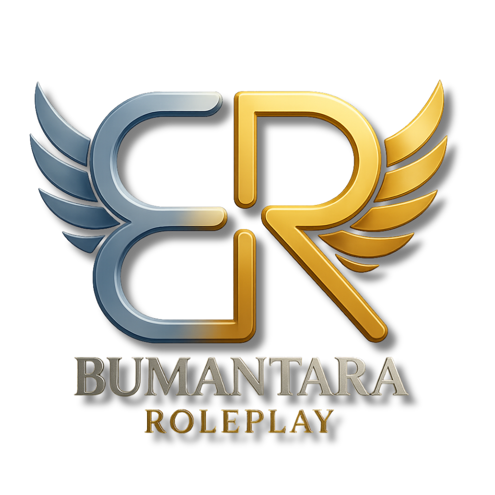

# Welcome to the Bumantara Roleplay Documentation

  

  <em>"Rewrite Your Destiny in the Sky Full of Stories"</em>

---

## Welcome to Bumantara

Welcome, Citizen of Bumantara. You are currently reading the official information hub for the **Bumantara Roleplay** server. This document was created to be your primary guide to understanding our world, rules, and the systems we offer.

Our vision is to provide an immersive, high-quality roleplay experience supported by a solid community. This GitBook is one of our steps towards achieving that goal by providing structured and easily accessible information.

<!-- ## Where to Start?

For those of you who have just joined, we highly recommend reading the following essential pages in order to ensure you have a strong understanding before beginning your journey:

* **[Server Rules](./server-rules.md)**: The primary foundation and laws that apply within the server. Adherence to these rules is mandatory.
* **[Beginner's Guide](./beginners-guide.md)**: Your first steps, from character creation to how to interact in-game.
* **[Lore & Background](./city-lore.md)**: The story behind the city of Bumantara. Understanding the lore will enrich your roleplay experience. -->

## Stay Connected

This documentation will be continuously updated as the server evolves. Be sure to check back for any new announcements or changes.

For discussions, interactions, and real-time information, join our main community on Discord.

**[➡️ Join us on Discord!](https://discord.gg/J2MXraMQHq)**