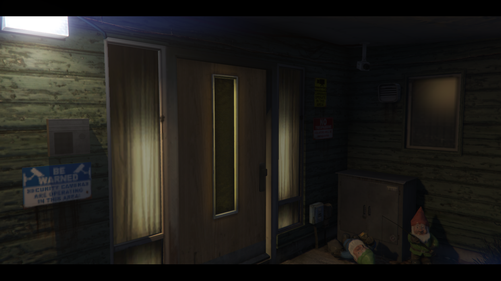
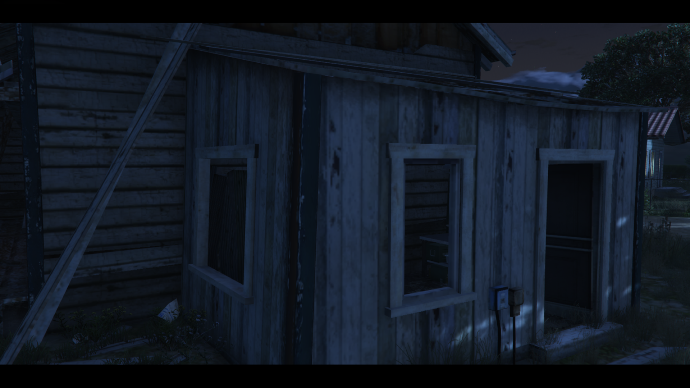
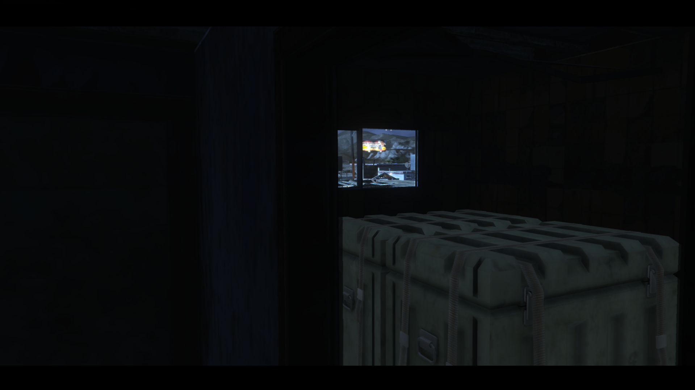

Aktivitas ilegal tidak diiklankan secara terbuka. Informasi ini harus ditemukan melalui roleplay, membangun koneksi, dan menjelajahi kota.

Halaman ini tidak akan memberi Anda jawaban. Halaman ini hanya berisi kumpulan petunjuk (IC Clues) yang berhasil dikumpulkan mengenai aktivitas "badside" di Bumantara. Gunakan informasi ini sebagai titik awal pencarian Anda di dalam kota.

---

### 🛠️ Petunjuk: Crafting Peralatan (Tools)
> 

> 
Berlokasi pada suatu tempat daerah timur los santos, tempat sepasang kekasih tua menghabiskan waktunya.

---

### 🔫 Petunjuk: Crafting Senjata

#### Low Tier
> 

> 
Berlokasi di puncak tertinggi saat anda membuka petunjuk arah. Mungkin sering anda lewati namun tak terlirik, tidak lama lagi akan hancur karena tidak dihuni dan tak terawat.

#### Mid Tier
> 

> 
Berlokasi di perkumpulan mobil penjelajah dengan angin yang sangat kencang di daerah tersebut, mereka sering sarapan di restoran jaman batu.

#### High Tier
> 

> 
Berlokasi di suatu daerah terpencil dengan rasa yang asin, cocok dijadikan tempat terbaik untuk bercerita.

---

### 🎯 Petunjuk: Crafting Amunisi
> 

> 
Berlokasi di suatu asrama terbengkalai yang sangat berpasir, tak banyak orang tau tentang tempat ini, namun cukup besar untuk terlihat.
