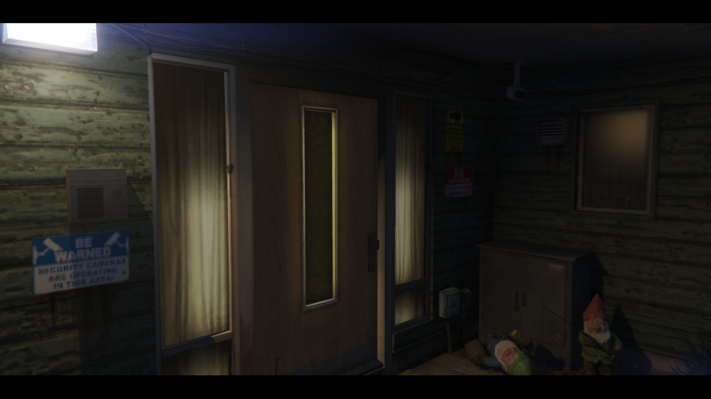
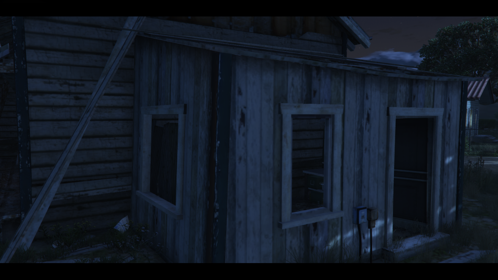
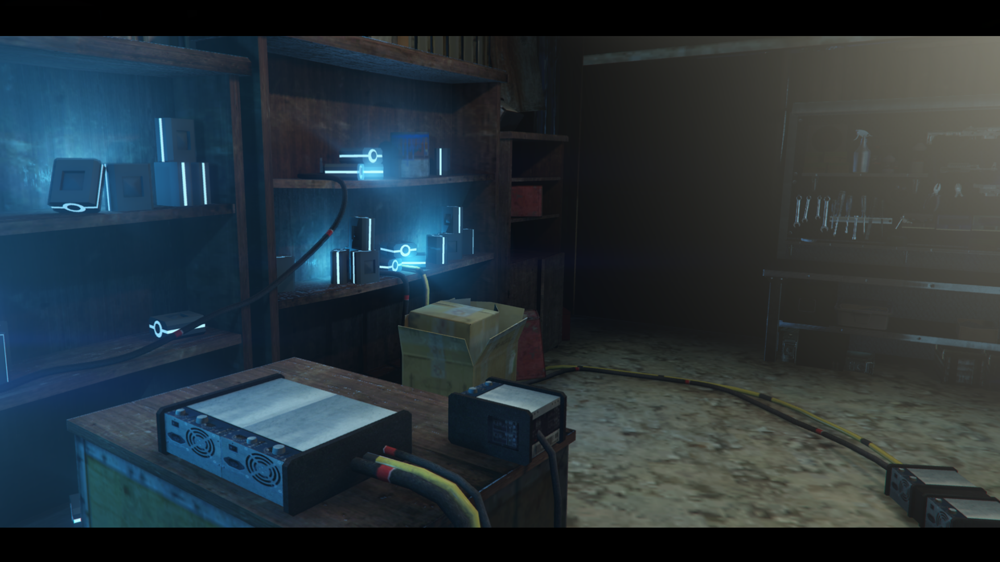
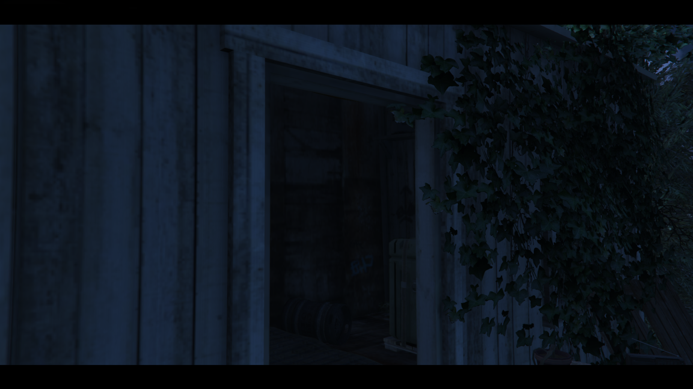
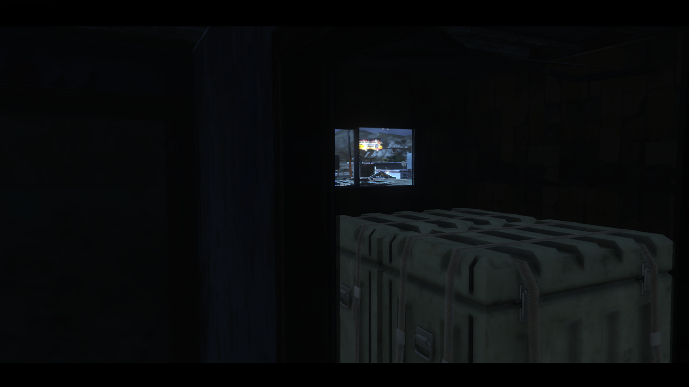
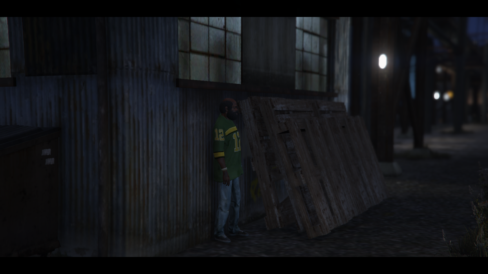
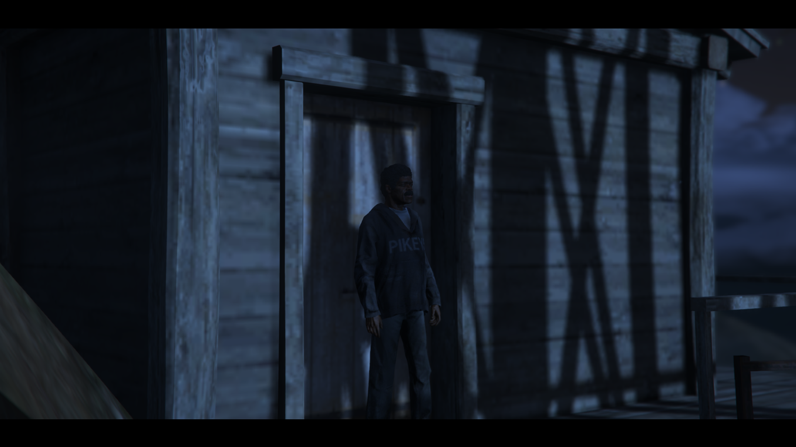
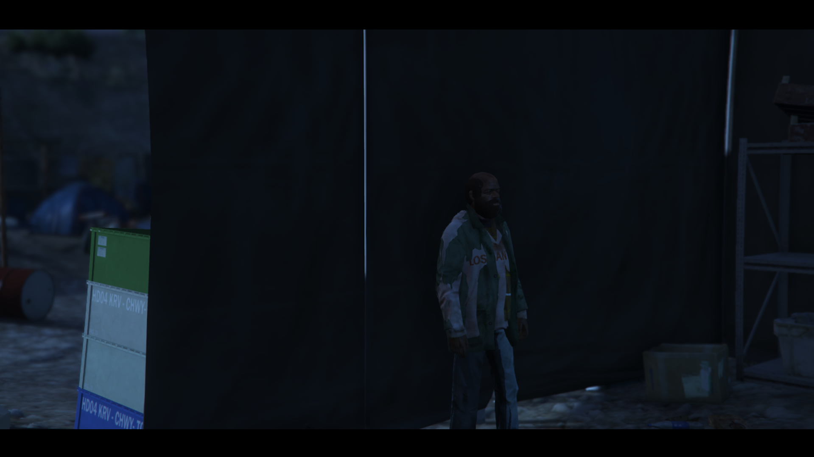
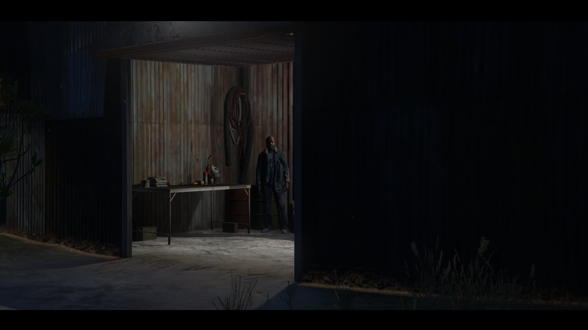

Aktivitas ilegal tidak diiklankan secara terbuka di kota ini. Informasi ini adalah sesuatu yang harus Anda temukan sendiri melalui roleplay, membangun koneksi dengan orang yang tepat, dan ketelitian dalam menjelajahi sudut-sudut kota Bumantara.

> **PENAFIAN:** Halaman ini **tidak akan memberikan jawaban langsung**. Halaman ini hanya berisi kumpulan petunjuk visual dan teka-teki (IC Clues) sebagai titik awal pencarian Anda.

---

## 🛠️ Crafting Peralatan (Tools)

  
    
  <em>"Berlokasi pada suatu tempat daerah timur los santos, tempat sepasang kekasih tua menghabiskan waktunya."</em>

---

## 🔫 Crafting Senjata (Weaponry)

Perakitan senjata terbagi menjadi beberapa tingkatan (Tier) yang berlokasi di tempat berbeda.

### 🔹 Low Tier

  
    
  <em>"Berlokasi di puncak tertinggi saat anda membuka petunjuk arah. Mungkin sering anda lewati namun tak terlirik, tidak lama lagi akan hancur karena tidak dihuni dan tak terawat."</em>

### 🔹 Mid Tier

  
    
  <em>"Berlokasi di perkumpulan mobil penjelajah dengan angin yang sangat kencang di daerah tersebut, mereka sering sarapan di restoran jaman batu."</em>

### 🔹 High Tier

  
    
  <em>"Berlokasi di suatu daerah terpencil dengan rasa yang asin, cocok dijadikan tempat terbaik untuk bercerita."</em>

---

## 🎯 Crafting Amunisi (Ammo)

  
    
  <em>"Berlokasi di suatu asrama terbengkalai yang sangat berpasir, tak banyak orang tau tentang tempat ini, namun cukup besar untuk terlihat."</em>

---

## 🏪 Pasar Gelap (Blackmarket)

Penjual di pasar gelap adalah sosok yang misterius dan tidak menetap.

> **⚠️ CATATAN PENTING:**
> NPC Blackmarket akan **berpindah lokasi secara acak setiap 2 jam sekali**. Anda harus mencarinya di salah satu dari 4 kemungkinan lokasi berikut:

### 📍 Kemungkinan Lokasi 1

  
    
  <em>"Aku lahir di keluarga nelayan, sekarang untuk menghabiskan masa tua aku sering berdiri di belakang gudang tua untuk melihat kapal container SS BULKER berlalu lalang."</em>

### 📍 Kemungkinan Lokasi 2

  
    
  <em>"Aku tinggal di pondok kecil di atas gunung, di bawah rumah ku terdapat pemukiman yang sangat aneh, setiap minggu selalu ada orang baru yang di antar ke sana tapi jumlah penduduk di sana tidak pernah bertambah, sampai sekarang masih menjadi misteri kemana orang-orang itu."</em>

### 📍 Kemungkinan Lokasi 3

  
    
  <em>"Aku adalah homeless yang di beri tempat tinggal oleh keluarga kecil di ujung kota, banyak juga yang seperti ku di sini sampai akhirnya kami memberi nama tempat ini sebagai 'desa bermartabat'."</em>

### 📍 Kemungkinan Lokasi 4

  
    
  <em>"Aku bekerja di sebuah bengkel kecil yang ada di dermaga, aku menghabiskan hari-hari ku memperbaiki kapal, ada kalanya aku di suruh membersihkan rumah keluarga godfather yang tidak jauh dari bengkel ku."</em>

